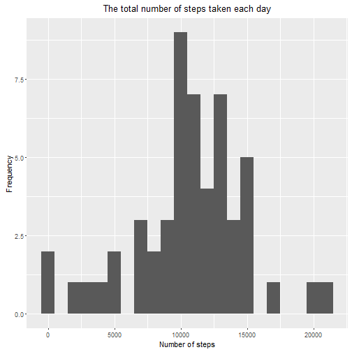
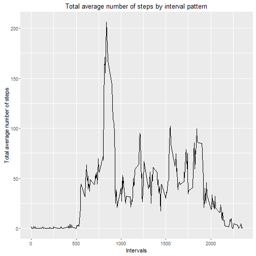
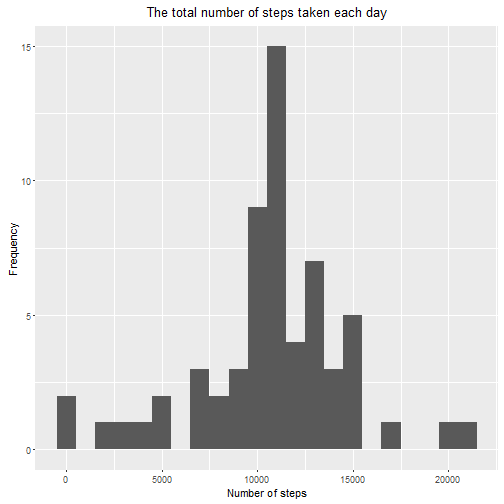
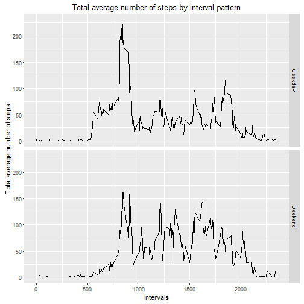

## Loading and preprocessing the data

The following code will upload the relevant libraries and the file. It will then change the date class.


```r
#load the specific libraries needed for this exercise
library(knitr)
library(lubridate)
library(dplyr)
library(ggplot2)

##read in the data from the zip file
activity <- read.csv (unz("activity.zip", "activity.csv"))

##change date class
activity$date <- as.Date(activity$date)
```

## What is mean total number of steps taken per day?


The total number of steps taken is as for the histogram below:


```r
step <- aggregate(steps~date, data =activity, FUN = sum )

#create an histogram
qplot(data= step, steps, geom="histogram", binwidth=1000) + ggtitle(expression("The total number of steps taken each day")) + xlab("Number of steps") + ylab("Frequency")
```



```r
#calculate mean and median for the dataset
meanstep<-round(mean(step$steps, na.rm = TRUE),1)
medianstep<-round(median(step$steps,na.rm = TRUE),1)
```

The overall mean is 1.07662 &times; 10<sup>4</sup>, while the median is 1.0765 &times; 10<sup>4</sup>.


## What is the average daily activity pattern?

Below a series plot of the average of the steps taken by each 5-minutes interval


```r
# average step taken by interval
avg_steps <- aggregate(steps ~ interval, data =activity, FUN = mean )


qplot(interval, steps, data= avg_steps,  geom="line") + ggtitle("Total average number of steps by interval pattern") + ylab("Total average number of steps")+ xlab("Intervals") 
```



```r
#position of the max value
max_point<-which.max(avg_steps$steps)
interval_maxsteps<- avg_steps[max_point,1]

max_steps <- round(avg_steps[max_point,2] ,1)
```

The maximum average of steps taken was 206.2 which were taken at 835 interval.

## Imputing missing values

In this session we are going to replace the missing value with the mean of the the associated interval and we are going to estimate the impact of these new values have.

Firstly, we are calculating the total number of missing value


```r
Total_NAs <- sum(is.na(activity$steps))
```
which is 2304.


```r
#save the file in a new one
replace_NAs <- activity

# replace the missing value with the mean of the 5 minutes interval
for (interval in unique(replace_NAs$interval)) replace_NAs[replace_NAs$interval == interval & is.na(replace_NAs$steps),'steps'] = round(avg_steps[avg_steps$interval == interval , 'steps'],digits=0)
```

with the new datasets we can plot the new histogram


```r
step_replace <- aggregate(steps~date, data = replace_NAs, FUN = sum )
qplot(data= step_replace, steps, geom="histogram", binwidth=1000) + ggtitle(expression("The total number of steps taken each day")) + xlab("Number of steps") + ylab("Frequency")
```



```r
newmean<- round(mean(step_replace$steps),1)
newmedian<- round(median(step_replace$steps),1)
```

The new mean and mean are respectively 1.07656 &times; 10<sup>4</sup>,1.0762 &times; 10<sup>4</sup> which are lower than those calculate before (1.07662 &times; 10<sup>4</sup>, 1.0765 &times; 10<sup>4</sup>). 

## Are there differences in activity patterns between weekdays and weekends?

Still using the newly modified dataset, we are going to calculate the difference between steps taken during weekdays and weekends. 


```r
#add a filed with the type of days of the week
replace_NAs$weekday <- ifelse(weekdays(replace_NAs$date) %in% c("Saturday","Sunday"), "weekend", "weekday")

step_weekdate<- aggregate(replace_NAs$steps, by = list(replace_NAs$weekday, replace_NAs$interval),FUN = mean )

step_weekdate <- rename(step_weekdate, weekday=Group.1, interval=Group.2, steps=x)

#plot two charts 
qplot(interval, steps, data= step_weekdate,  geom="line", facets= weekday ~.) + ggtitle("Total average number of steps by interval pattern") + ylab("Total average number of steps")+ xlab("Intervals")
```


